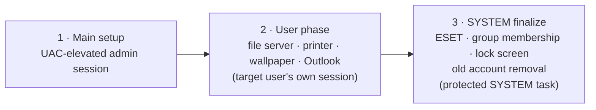

<div align="center">

# AÇIK Kurulum

**A Windows corporate laptop onboarding tool** — one screen to take a fresh
Windows device from unboxed to fully provisioned: accounts, network,
security tooling, desktop policy, and reporting.


*Türkçe sürüm için [README.tr.md](README.tr.md) dosyasına bakın.*

</div>

---

> **Public source-code copy.** This repository is not an operational
> installation package — it ships without any real credentials, VPN
> profiles, installers, or test fixtures. See
> [Public source delivery](#-public-source-delivery) for exactly what has
> been left out and why.

## Contents

- [What it automates](#what-it-automates)
- [Security model](#-security-model)
- [Running from source](#running-from-source)
- [Building a clean release](#building-a-clean-release)
- [Configuration](#configuration)
- [Project layout](#project-layout)
- [Public source delivery](#-public-source-delivery)
- [Requirements](#requirements)
- [License](#license)

## What it automates

| Area | What happens |
|---|---|
| **Accounts** | Local or domain user creation, computer renaming, with a documented, auditable privilege model. |
| **Network** | Wi-Fi profile install + time sync, corporate file server connection, network printer setup. |
| **Desktop** | Wallpaper / lock screen policy, desktop signature files, Outlook Classic setup. |
| **Software** | ESET, AnyDesk, Chrome, FortiClient VPN, Office, JRE, WinRAR, and (opt-in) HackBGRT. |
| **System** | Windows activation, Windows Update, and a final scheduled restart. |
| **Reporting** | JSON run reports, plus optional webhook/Telegram notifications. |

What makes this more than a script: onboarding a laptop legitimately spans
**multiple Windows sessions and at least one reboot**. AÇIK Kurulum tracks
that as a durable, versioned workflow — steps that must run in the new
user's own session, or as `SYSTEM`, are scheduled and retried automatically
across restarts for up to 48 hours, with a safe timeout if something never
completes.

## 🔒 Security model

The application **never** grants the operator or the new user temporary
administrator membership — that would leave the existing session token
un-elevated while over-provisioning the account. Instead, the workflow is
split into three stages, each running with only the privilege it needs:



The app that runs after reboot is copied to
`%ProgramData%\AcikOnboarding\app`, so the workflow does not depend on the
USB drive letter or on the USB drive staying plugged in once setup has
started.

See [`SECURITY.md`](SECURITY.md) for the full authorization model, secret
handling rules, and command/file safety notes (in Turkish, matching the rest
of the in-repo documentation).

## Running from source

```powershell
python .\run_app.py
```

`run_app.py` prepares a local `.dev-venv` environment for development,
installs missing dependencies, and requests UAC elevation on a normal run.

Tests never use real operational passwords:

```powershell
python -m pytest -q
```

> The automated test suite and the private domain-join helper are
> intentionally excluded from this public copy — see below.

## Building a clean release

```powershell
powershell.exe -NoProfile -ExecutionPolicy Bypass -File .\build_release.ps1
```

The script installs dependencies into a separate `.build-venv`, refreshes the
payload manifest, runs the tests, and produces the result in:

```text
release\ACIK-Kurulum-v4\
```

No operational configuration or Windows product key is included in a clean
release.

To prepare an operational bundle on a BitLocker-protected USB/NTFS target:

```powershell
.\prepare_operational_bundle.ps1 -TargetDir "E:\ACIK-Kurulum-v4"
```

## Configuration

Configuration is resolved in this order:

1. `ACIK_CONFIG_PATH` environment variable
2. `app_config.local.json` next to the application
3. `private_secrets\app_config.local.json` next to the source tree
4. `app_config.example.json` (no passwords — the default in this repo)

Never keep real passwords, tokens, or product keys in source control, in a
release folder, or on a plain (unencrypted) USB drive. The operational
config file is protected by an ACL that only `Administrators` and `SYSTEM`
can read.

FortiClient VPN support is source-only here. A private build must supply its
own approved `.sconf` profile (see `payloads/README.md`) and provide its
export password at run time through the
`ACIK_FORTICLIENT_VPN_PROFILE_EXPORT_PASSWORD` environment variable. No
FortiClient connection details are included in this public copy.

## Project layout

```text
.
├── run_app.py                       UAC elevation, single-instance lock, run-mode selection
├── src/acik_onboarding/
│   ├── app.py                       wires the three run modes to services + UI
│   ├── ui.py                        PySide6 interface and background workers
│   ├── services.py                  Windows operations & onboarding business logic
│   ├── workflow.py                  durable task/phase state model (survives reboots)
│   └── config.py                    typed configuration model + safe JSON (de)serialization
├── tools/                           payload manifest generation
├── assets/                          bundled branding & wallpaper images
├── TROUBLESHOOTING.md               field diagnostics and common failure modes
└── SECURITY.md                      authorization and secret-handling rules
```

> `tests/` (identity, command, and post-reboot workflow tests) is not
> included in this public copy — see below.

Windows account behavior, domain join, profile deletion, printer drivers, and
UEFI changes all depend on the real device. Before cutting a release, test
end-to-end on a clean Windows VM configured with the same GPOs/network as
production, and on at least one pilot laptop.

## 📦 Public source delivery

This copy of the source (version `5.21.31`) intentionally **excludes**:

- `app_config.local.json` and `private_secrets/`
- Domain, Wi-Fi, local-admin, backup, product-key, webhook, API-token, and
  VPN credentials
- Encrypted VPN profiles, plain VPN exports, certificates, and private keys
- `FORTICLIENT_VPN_PROFILE.md` (internal FortiClient connection name and
  gateway address)
- Third-party installer executables, boot assets, release output, logs, and
  diagnostic records
- The private domain-join helper and the automated test fixtures

`app_config.example.json` is the password-free example configuration. For a
private deployment, keep the real configuration in a protected location and
select it with `ACIK_CONFIG_PATH`; do not add it to this repository.

Before publishing a new snapshot of this source, regenerate the delivery
file manifest (`PUBLIC_DELIVERY_MANIFEST.json`) and re-run the same secret
scan used to verify this delivery.

## Requirements

| Purpose | Package | File |
|---|---|---|
| Runtime | `PySide6` | `requirements.txt` |
| Tests | `pytest` | `requirements-dev.txt` |
| Release builds | `PyInstaller` | `requirements-build.txt` |

Windows 10/11 and Python 3.11+.

## License

No license file is currently included in this repository. Until one is
added, treat this source as "all rights reserved" — check with the
maintainers before reusing it outside this project.
