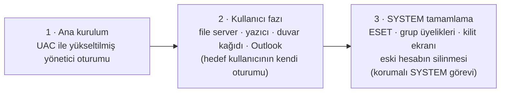

<div align="center">

# AÇIK Kurulum

**Kurumsal dizüstü bilgisayar hazırlama aracı** — kutudan çıkan bir Windows
cihazı; hesaplar, ağ, güvenlik yazılımları, masaüstü ilkeleri ve raporlama
dahil olmak üzere tek ekrandan tam donanımlı hale getirir.


*For the English version, see [README.md](README.md).*

</div>

---

> **Genel kaynak kodu kopyası.** Bu depo operasyonel bir kurulum paketi
> değildir — gerçek kimlik bilgisi, VPN profili, yükleyici veya test
> fixture'ı içermeden dağıtılır. Tam olarak neyin çıkarıldığını ve nedenini
> görmek için [Genel kaynak kodu teslimi](#-genel-kaynak-kodu-teslimi)
> bölümüne bakın.

## İçindekiler

- [Neyi otomatikleştiriyor](#neyi-otomatikleştiriyor)
- [Güvenli çalışma modeli](#-güvenli-çalışma-modeli)
- [Kaynaktan çalıştırma](#kaynaktan-çalıştırma)
- [Temiz sürüm üretme](#temiz-sürüm-üretme)
- [Yapılandırma](#yapılandırma)
- [Proje haritası](#proje-haritası)
- [Genel kaynak kodu teslimi](#-genel-kaynak-kodu-teslimi)
- [Gereksinimler](#gereksinimler)
- [Lisans](#lisans)

## Neyi otomatikleştiriyor

| Alan | Ne oluyor |
|---|---|
| **Hesaplar** | Belgelenmiş, denetlenebilir bir yetki modeliyle yerel veya domain kullanıcı oluşturma, bilgisayar adı değiştirme. |
| **Ağ** | Wi-Fi profili kurulumu + saat senkronizasyonu, kurumsal dosya sunucusu bağlantısı, ağ yazıcısı kurulumu. |
| **Masaüstü** | Duvar kağıdı / kilit ekranı ilkesi, masaüstü imza dosyaları, Outlook Classic kurulumu. |
| **Yazılım** | ESET, AnyDesk, Chrome, FortiClient VPN, Office, JRE, WinRAR ve (isteğe bağlı) HackBGRT. |
| **Sistem** | Windows etkinleştirme, Windows Update ve son bir zamanlanmış yeniden başlatma. |
| **Raporlama** | JSON çalışma raporları, isteğe bağlı webhook/Telegram bildirimleri. |

Bunu basit bir betikten fazlası yapan şey şu: bir dizüstü bilgisayarı
gerçek anlamda hazırlamak **birden fazla Windows oturumu ve en az bir
yeniden başlatma** gerektirir. AÇIK Kurulum bunu kalıcı, sürümlenmiş bir
iş akışı olarak izler — yeni kullanıcının kendi oturumunda veya `SYSTEM`
olarak çalışması gereken adımlar, tamamlanana kadar en fazla 48 saat
boyunca yeniden başlatmalar arasında otomatik olarak zamanlanır ve
yeniden denenir; hiçbir zaman tamamlanmazsa güvenli bir zaman aşımı
devreye girer.

## 🔒 Güvenli çalışma modeli

Uygulama operatöre veya yeni kullanıcıya **hiçbir zaman** geçici yönetici
üyeliği vermez — bu yöntem mevcut oturum belirtecini yükseltmeden hesabı
gereğinden fazla yetkilendirir. Bunun yerine akış, her biri yalnızca
ihtiyacı olan yetkiyle çalışan üç aşamaya ayrılır:



Yeniden başlatma sonrası çalışacak uygulama `%ProgramData%\AcikOnboarding\app`
altına kopyalanır. Bu nedenle kurulum başladıktan sonra USB sürücü harfine
veya USB'nin takılı kalmasına bağımlı değildir.

Tam yetkilendirme modeli, sır yönetimi kuralları ve komut/dosya güvenliği
notları için [`SECURITY.md`](SECURITY.md) dosyasına bakın (depodaki diğer
dokümantasyonla uyumlu olarak Türkçe).

## Kaynaktan çalıştırma

```powershell
python .\run_app.py
```

`run_app.py` geliştirme için yerel bir `.dev-venv` ortamı hazırlar, eksik
bağımlılıkları kurar ve normal bir çalıştırmada UAC yükseltmesi ister.

Testler gerçek operasyon parolalarını asla kullanmaz:

```powershell
python -m pytest -q
```

> Otomatik test paketi ve özel domain-katılım yardımcı betiği bu genel
> kopyadan kasıtlı olarak çıkarılmıştır — ayrıntılar aşağıda.

## Temiz sürüm üretme

```powershell
powershell.exe -NoProfile -ExecutionPolicy Bypass -File .\build_release.ps1
```

Betik, bağımlılıkları ayrı bir `.build-venv` ortamına kurar, payload
manifestini yeniler, testleri çalıştırır ve sonucu şuraya üretir:

```text
release\ACIK-Kurulum-v4\
```

Temiz bir sürüme hiçbir operasyonel yapılandırma veya Windows ürün
anahtarı dahil edilmez.

BitLocker korumalı bir USB/NTFS hedefe operasyonel bir paket hazırlamak
için:

```powershell
.\prepare_operational_bundle.ps1 -TargetDir "E:\ACIK-Kurulum-v4"
```

## Yapılandırma

Yapılandırma şu sırayla çözümlenir:

1. `ACIK_CONFIG_PATH` ortam değişkeni
2. Uygulamanın yanındaki `app_config.local.json`
3. Kaynak ağacının yanındaki `private_secrets\app_config.local.json`
4. `app_config.example.json` (parolasız — bu depodaki varsayılan)

Gerçek parolaları, token'ları veya ürün anahtarlarını kaynak kod
kontrolünde, bir release klasöründe veya şifrelenmemiş düz bir USB
sürücüde asla tutmayın. Operasyonel yapılandırma dosyası, yalnızca
`Administrators` ve `SYSTEM`'in okuyabileceği bir ACL ile korunur.

FortiClient VPN desteği burada yalnızca kaynak kod düzeyindedir. Özel bir
derleme, kendi onaylı `.sconf` profilini sağlamalıdır (bkz.
`payloads/README.md`) ve export parolasını çalışma zamanında
`ACIK_FORTICLIENT_VPN_PROFILE_EXPORT_PASSWORD` ortam değişkeni üzerinden
vermelidir. Bu genel kopyada hiçbir FortiClient bağlantı bilgisi yer
almaz.

## Proje haritası

```text
.
├── run_app.py                       UAC yükseltmesi, tek örnek kilidi, çalışma modu seçimi
├── src/acik_onboarding/
│   ├── app.py                       üç çalışma modunu servisler + UI ile bağlar
│   ├── ui.py                        PySide6 arayüzü ve arka plan işçileri
│   ├── services.py                  Windows işlemleri ve onboarding iş mantığı
│   ├── workflow.py                  kalıcı görev/faz durum modeli (yeniden başlatmalara dayanıklı)
│   └── config.py                    tipli yapılandırma modeli + güvenli JSON (de)serileştirme
├── tools/                           payload manifest üretimi
├── assets/                          gömülü marka ve duvar kağıdı görselleri
├── TROUBLESHOOTING.md               saha teşhisi ve yaygın hata modları
└── SECURITY.md                      yetkilendirme ve sır yönetimi kuralları
```

> `tests/` (kimlik, komut ve yeniden başlatma sonrası iş akışı testleri) bu
> genel kopyaya dahil değildir — ayrıntılar aşağıda.

Windows hesap davranışı, domain katılımı, profil silme, yazıcı sürücüleri
ve UEFI değişikliklerinin tümü gerçek cihaza bağlıdır. Bir sürüm almadan
önce, üretimle aynı GPO'lara/ağ yapılandırmasına sahip temiz bir Windows
sanal makinesinde ve en az bir pilot dizüstü bilgisayarda uçtan uca test
yapın.

## 📦 Genel kaynak kodu teslimi

Bu kaynak kodu kopyası (sürüm `5.21.31`) kasıtlı olarak şunları
**çıkarır**:

- `app_config.local.json` ve `private_secrets/`
- Domain, Wi-Fi, yerel yönetici, yedekleme, ürün anahtarı, webhook,
  API-token ve VPN kimlik bilgileri
- Şifrelenmiş VPN profilleri, düz VPN export'ları, sertifikalar ve özel
  anahtarlar
- `FORTICLIENT_VPN_PROFILE.md` (dahili FortiClient bağlantı adı ve gateway
  adresi)
- Üçüncü taraf yükleyici çalıştırılabilirleri, önyükleme varlıkları,
  release çıktısı, günlükler ve teşhis kayıtları
- Özel domain-katılım yardımcı betiği ve otomatik test fixture'ları

`app_config.example.json`, parolasız örnek yapılandırmadır. Özel bir
dağıtım için gerçek yapılandırmayı korunan bir konumda tutun ve
`ACIK_CONFIG_PATH` ile seçin; bu depoya eklemeyin.

Bu kaynak kodunun yeni bir anlık görüntüsünü yayımlamadan önce, teslimat
dosya manifestini (`PUBLIC_DELIVERY_MANIFEST.json`) yeniden oluşturun ve
bu teslimatı doğrulamak için kullanılan sır taramasını tekrar çalıştırın.

## Gereksinimler

| Amaç | Paket | Dosya |
|---|---|---|
| Çalışma zamanı | `PySide6` | `requirements.txt` |
| Testler | `pytest` | `requirements-dev.txt` |
| Release derlemeleri | `PyInstaller` | `requirements-build.txt` |

Windows 10/11 ve Python 3.11+.

## Lisans

Bu depoda şu anda bir lisans dosyası bulunmamaktadır. Bir lisans
eklenene kadar bu kaynak kodunu "tüm hakları saklıdır" olarak kabul
edin; bu proje dışında yeniden kullanmadan önce bakım ekibiyle görüşün.
